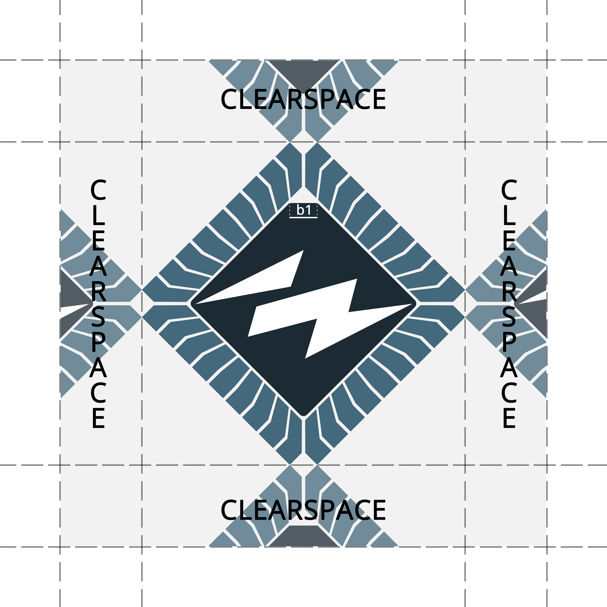

# Memo for Graphical Profile

## 1 Formalities
### 1.1 Purpose
The purpose of this memo is to define how documents and other material from the chapter looks, to ensure that it is clear that the chapter is the sender, and to formalise the chapter’s attributes and how these may and shall be used.  

The material being produced shall be uniform in nature, and the chapter’s attributes may not be wrongfully used.

### 1.2 History
Established: 2017-05-23  
Changed: 2017-05-23

## 2 Logotype
The chapter’s logotype is defined in the Memo for Insignia.

### 2.1 Colourisation
The legs of the microchip shall be of the color "kiselblå" (`#44687D`) (see §1.2 in the chapter's bylaws) and the centrum shall have a darker tone of the same color (for example `#262D33`).  
The lightning bolt shall be white (`#FFFFFF`).

In the case that the official emblem cannot be displayed without difficulties there is two monochrome variants of the emblem to use, one white and one black.  
In the monochrome version the legs of the microchip have the same color as the lightning bolt, while the centrum is void of color.  
The monochrome emblems can for example be used in print, on clothes, or posters.

The chapter’s logotype may not be broken apart, and the fully coloured logotype may not be coloured in any other way, or with other colours than those defined above.  
The monochrome logotypes may be coloured in other colours than those defined above, given that all elements of the logotype are of the same colour.

### 2.2 Usage
For posters and the like the logotype shall be placed in one of the poster’s corners, in accordance with the provided templates and defined proportions.

If the logotype is used together with THS’ logotype, it should be placed in the opposite upper corner.  
Use the monochrome logotypes if the coloured logotype is is not sufficiently visible against a background.

When using the monochrome logotypes, the white logotype shall be used if the back-ground is dark, and the black if the background is light.

The distance to other elements should be at least half of the logo-type’s width, on all sides.

## 3 Typography
The chapter primarily use the font Open Sans for web and print.

## 4 Colours
### 4.1 Chapter colour
The chapter's colour is Kiselblå, it is defined as:  
RGB/hex: `#44687D NCS: S 4030-B`  
CMYK: `45.6, 16.8, 0, 50.98`  
PMS: `5405 C`  
Lab: `42.2, -6.8, -15.7`

### 4.2 Programme colours
Civilingenjör Informationsteknik: laserviolett  
RGB/hex: `#CC99FF`  
Civilingenjör Mikroelektronik: limegrönt  
RGB/hex: `#ADFF5C`  
Högskoleingenjör Elektronik och datorteknik: vitt  
RGB/hex: `#FFFFFF`  
Högskoleingenjör Datateknik: rosa (cerise)  
RGB/hex: `#E83D84`  
Kandidatutbildning Informations och kommunikationsteknik: laserviolett  
RGB/hex: `#CC99FF`
